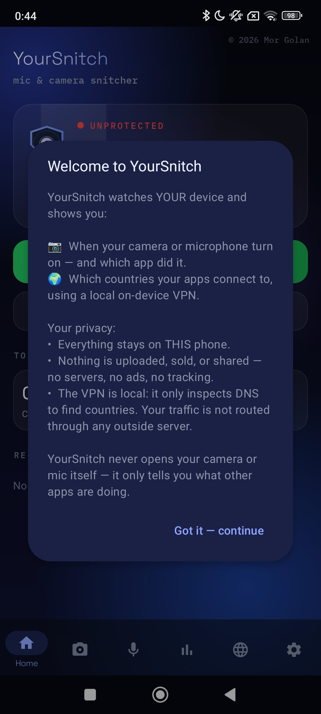

<p align="center">
  
</p>
# YourSnitch

YourSnitch is an on-device privacy monitor for Android. It tells you **when your camera or
microphone are used and which app used them**, and shows **which countries your device's
connections reach** — all processed locally, with nothing sent off your phone.

> It is a **monitor / alerter, not a blocker.** It never opens the camera or microphone itself
> and does not stop other apps — it shows you what is happening so you can decide what to do.


</p>

## Features

- **Camera & mic monitor** — names the app and logs the time whenever the camera or mic turns
  on, with a live status you can glance at.
- **Connection monitor** — a local, on-device VPN inspects DNS lookups to show the domains and
  the countries your apps connect to. Your normal traffic is **not** routed through any server.
- **On-device history** you can clear at any time.
- **No account, no servers, no ads, no analytics, no tracking SDKs.**

On first launch YourSnitch shows a one-time disclosure of what it does and that all data stays
on the device, before requesting any permission.

## How it works

- **Which app?** `UsageStatsManager` (Usage Access) identifies the foreground app at the moment a
  sensor activates; `AppOpsManager` availability callbacks detect camera/mic on/off transitions.
- **Which country?** A split-tunnel `VpnService` routes only the DNS stub address, reads each DNS
  query, forwards it to a public resolver (Cloudflare 1.1.1.1 / Google 8.8.8.8 / Quad9 9.9.9.9),
  and maps the answer IP to a country using a bundled **offline** GeoIP table. All other traffic
  is left untouched and exits the device directly.
- A single shared foreground-service notification keeps monitoring alive across both features.

## Build

Requires a JDK (17–21) and the Android SDK (platform 35 + build-tools 35).

```bash
export JAVA_HOME=/usr/lib/jvm/java-21-openjdk-amd64   # any JDK 17–21
export ANDROID_HOME=$HOME/Android/Sdk                  # your SDK location
./gradlew assembleDebug        # -> watch/build/outputs/apk/debug/watch-debug.apk
./gradlew bundleRelease        # signed .aab for Google Play (see signing below)
```

### Release signing

Release builds read `keystore.properties` at the repo root (gitignored — never commit it):

```
storeFile=upload-keystore.jks
storePassword=YOUR_PASSWORD
keyAlias=YOUR_ALIAS
keyPassword=YOUR_PASSWORD
```

Generate a key once:

```bash
keytool -genkeypair -keystore upload-keystore.jks -alias yoursnitch \
  -keyalg RSA -keysize 2048 -validity 10000
```

## Permissions and why they are used

- **Usage Access (`PACKAGE_USAGE_STATS`)** — name the foreground app when a sensor is used.
- **VPN (`VpnService`)** — local DNS inspection for the connection monitor. No traffic is proxied
  to any external server.
- **`QUERY_ALL_PACKAGES`** — resolve the name/icon of any installed app that uses a sensor.
- **Notifications, foreground service, run at boot, ignore battery optimizations** — keep
  monitoring running reliably.
- **Internet** — forward DNS lookups to the public resolvers listed above.

## Privacy

Everything is processed on-device. See [`PRIVACY_POLICY.md`](PRIVACY_POLICY.md). No data is
collected or transmitted to the developer.

## Known limitations

- **It reports, it does not block.** It cannot prevent an app from accessing a sensor.
- **The connection monitor only sees DNS-based connections.** Apps that connect to hard-coded IPs
  or cache them (e.g. Telegram/MTProto), or that use DNS-over-HTTPS, will not appear.
- On some MIUI/HyperOS builds the usage-stats log can lag (a reboot clears it), and Usage Access
  may be blocked for sideloaded apps until you enable "Allow restricted settings".

## Project layout

- `watch/` — the application module.
  - `MainActivity` / `SplashActivity` — UI (Home / Camera / Mic / Net tabs) + first-run disclosure.
  - `WatchService` — camera/mic usage monitor (foreground service).
  - `net/SniffVpnService` — DNS-capture VPN and per-connection country lookup.
  - `net/GeoIp` — offline IPv4→country lookup over the bundled `geoip.bin`.
  - `MonitorNotif` — the single shared ongoing notification for both services.
  - `Prefs`, `History`, `BootReceiver`, `AppOpsCameraWatcher`.

## License

- **Code:** MIT — see [`LICENSE`](LICENSE).
- **Bundled IP→country data** (`watch/src/main/assets/geoip.bin`): **CC0-1.0 / public domain**,
  derived from the [ip-location-db](https://github.com/sapics/ip-location-db) project
  (`geo-whois-asn-country`).


<h2 align="center">🎬Video</h2>

<p align="center">
  <a href="https://www.youtube.com/shorts/ZUR8eMDsvbg">
    
  </a>
</p>

© 2026 Mor Golan
